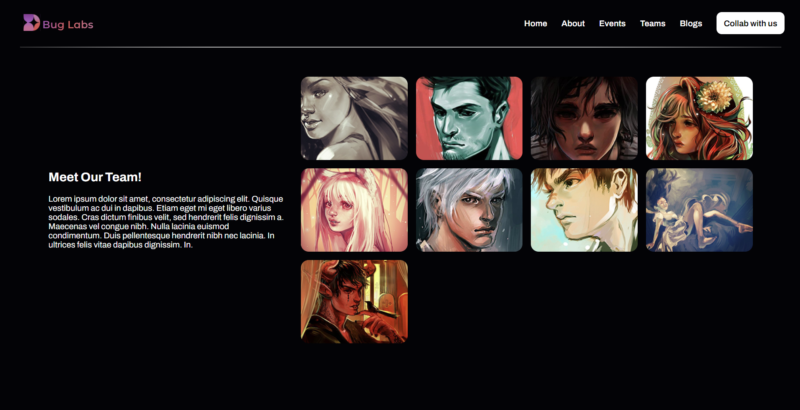

# Gallery Project

## Description

The Gallery Project is a minimalist and visually captivating showcase of artworks, designed and developed using modern HTML and CSS techniques. It employs the power of CSS grids and flexbox to create a seamless browsing experience for users.

## Features

- **Sleek Design**: The gallery features a clean and minimalist design aesthetic, allowing the artworks to take center stage.
- **Responsive Layout**: Built with responsiveness in mind, the gallery adapts gracefully to various screen sizes and devices.
- **HTML and CSS Only**: The entire project is created using only HTML and CSS, showcasing the versatility and power of these languages.
- **Easy Customization**: With well-organized and commented code, the gallery is easy to customize and extend according to your preferences.
- **Optimized Performance**: The use of modern CSS techniques ensures optimal performance and smooth animations, enhancing the overall user experience.

## Usage

To explore the gallery, simply open the `index.html` file in your preferred web browser. You can navigate through the artworks using the intuitive navigation controls.

## Contributing

Contributions are welcome! If you'd like to enhance the gallery or fix any issues, feel free to submit a pull request. Please ensure that your code follows the project's coding standards and includes relevant documentation.

## Credits

- Artwork images sourced from [Mernan Behairi]()
- Built with ❤️ by [Shyam Jaiswal](https://github.com/jaiswalism)
